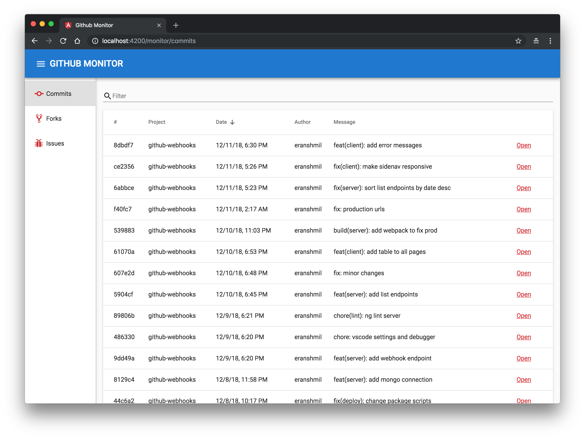

# Github Monitor



A basic app that monitors an entire GitHub Organization for commits, forks and issues, using Github Webhooks.

Live demo: https://sml-github-monitor.herokuapp.com

## Development

1. Copy .env.example to a new file called .env and update the environment configuration.
   If you don't want or can't use that method, you can simply define the variables in your environment.
1. Install dependencies:

   ```bash
   yarn install
   ```

1. Start server:

   ```bash
   yarn dev
   ```

1. Navigate to `http://localhost:4200/`.
